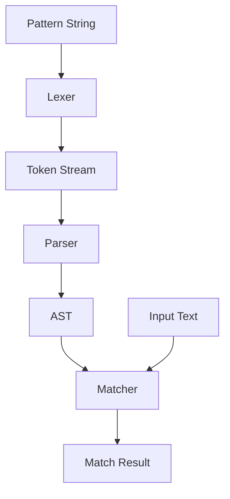

# SimpleMatch Pattern Matching Library

A simple, human-readable alternative to regex with an intuitive `[type:range:length]` syntax.

## Overview

This library provides a pattern matching engine with a simplified syntax that is easier to read and write than traditional regex. The core token format is:

```
[type:range:length]
```

Where:
- **type**: Character class (str, anum, num, hex, oct, dec, bin)
- **range**: Custom character range (optional, uses type defaults if empty)
- **length**: Length constraints (optional, e.g., `>=5`, `>1<3`, `1`)

---

## Architecture

Based on the MAP file, the architecture follows the classic pattern matching pipeline:



---

## Proposed Changes

### Module Structure

#### [NEW] [simplematch/](file:///home/aldalwachee/clones/idea/simplematch/)
New package directory for the pattern matching library.

#### [NEW] [__init__.py](file:///home/aldalwachee/clones/idea/simplematch/__init__.py)
Package init with public API exports:
- `match(pattern, text)` - Check if text matches pattern
- `find(pattern, text)` - Find first match in text
- `find_all(pattern, text)` - Find all matches in text

#### [NEW] [tokens.py](file:///home/aldalwachee/clones/idea/simplematch/tokens.py)
Token definitions and character class defaults:

| Type | Default Range | Description |
|------|--------------|-------------|
| `str` | `a-zA-Z` | Alphabetic characters |
| `anum` | `a-zA-Z0-9` | Alphanumeric characters |
| `num` | `0-9` | Numeric digits |
| `hex` | `0-9a-fA-F` | Hexadecimal characters |
| `oct` | `0-7` | Octal digits |
| `dec` | `0-9` | Decimal digits (alias for num) |
| `bin` | `01` | Binary digits |

#### [NEW] [lexer.py](file:///home/aldalwachee/clones/idea/simplematch/lexer.py)
Tokenizes the pattern string into a stream of tokens:
- `TOKEN_LITERAL` - Literal characters (e.g., `@`, `.`)
- `TOKEN_PATTERN` - Pattern tokens `[type:range:length]`

Example: `"[anum::]@[anum::].[str::>1<3]"` produces:
```
[PATTERN(type=anum, range=None, length=None)]
[LITERAL(@)]
[PATTERN(type=anum, range=None, length=None)]
[LITERAL(.)]
[PATTERN(type=str, range=None, length=">1<3")]
```

#### [NEW] [parser.py](file:///home/aldalwachee/clones/idea/simplematch/parser.py)
Parses the token stream into an Abstract Syntax Tree (AST):
- Validates syntax
- Resolves default ranges for types
- Parses length constraints into structured format

Length constraint formats:
| Syntax | Meaning |
|--------|---------|
| (empty) | 1 or more characters |
| `5` | Exactly 5 characters |
| `>=5` | 5 or more characters |
| `<=5` | 5 or fewer characters |
| `>1<3` | Between 2 and 2 characters (exclusive) |
| `>=1<=3` | Between 1 and 3 characters (inclusive) |

#### [NEW] [matcher.py](file:///home/aldalwachee/clones/idea/simplematch/matcher.py)
The matching engine that:
- Takes an AST and input text
- Attempts to match the pattern against the text
- Supports backtracking for variable-length patterns
- Returns match results with captured groups

---

### Range Syntax

The range field supports:
- **Default**: Empty means use type's default character set
- **Custom ranges**: `A-Z`, `a-z`, `0-9`
- **Character alternatives**: `S|s`, `A|B|C`
- **Combined**: `A-Za-z0-9`

---

### Example Patterns

| Pattern | Description | Matches |
|---------|-------------|---------|
| `[anum::]@[anum::].[str::>1<3]` | Email pattern | `example@mail.com` |
| `[str:A-Z:]` | Uppercase letters | `MARK` |
| `[str:A-Z:>=5]` | 5+ uppercase letters | `SAJJAD` |
| `[str:S\|s:1][str::]` | Name starting with S/s | `Sajjad` |
| `[hex::8]` | 8-char hex string | `1a2b3c4d` |
| `[bin::8]` | 8-bit binary | `10101010` |

---

## Verification Plan

### Automated Tests

#### [NEW] [tests/](file:///home/aldalwachee/clones/idea/tests/)
Test directory with:

#### [NEW] [test_lexer.py](file:///home/aldalwachee/clones/idea/tests/test_lexer.py)
- Test tokenization of various patterns
- Test literal character handling
- Test escape sequences

#### [NEW] [test_parser.py](file:///home/aldalwachee/clones/idea/tests/test_parser.py)
- Test AST generation
- Test length constraint parsing
- Test range parsing
- Test error handling for invalid patterns

#### [NEW] [test_matcher.py](file:///home/aldalwachee/clones/idea/tests/test_matcher.py)
- Test all provided examples
- Test edge cases
- Test backtracking with variable-length patterns

### Test Commands

```bash
# Run all tests
python -m pytest tests/ -v

# Run with coverage
python -m pytest tests/ --cov=simplematch
```

### Manual Verification

Will test the examples from the requirements:

```python
from simplematch import match

# Email matching
assert match("[anum::]@[anum::].[str::>1<3]", "example@mail.com")

# Capital letters
assert match("[str:A-Z:]", "MARK")

# 5+ capital letters
assert match("[str:A-Z:>=5]", "SAJJAD")

# Names starting with S or s
assert match("[str:S|s:1][str::]", "Sajjad")
```
